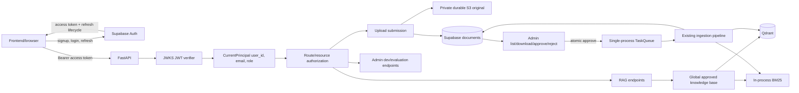
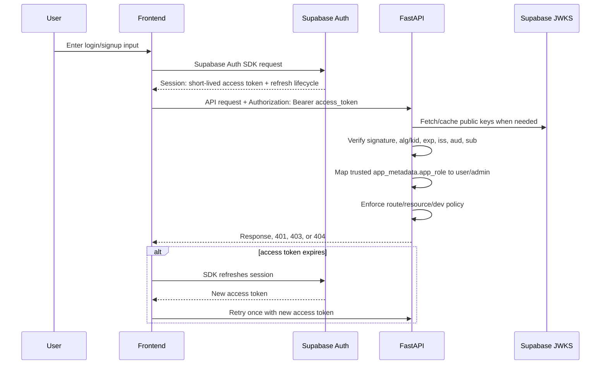
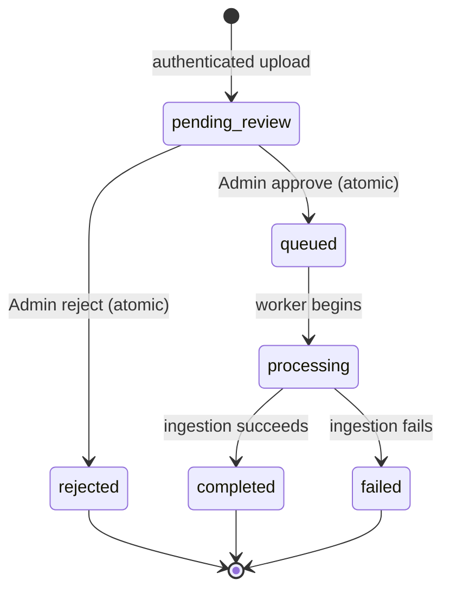

# Authentication and Authorization Architecture Review

> Review date: 2026-08-19. Scope: architecture only; no implementation, schema, dependency, configuration, or runtime changes were made. Current source code is treated as authoritative over README or prior reports.

## 1. Verdict

APPROVE WITH CHANGES

Supabase Auth with Supabase-issued access tokens and centralized FastAPI dependencies is the best fit for this repository and hackathon timeline. It avoids implementing password storage, recovery, email verification, token issuance, refresh rotation, and session management in a backend that currently has none of those capabilities.

The proposal is directionally correct, but incomplete in six important ways:

1. Authentication needs a precise token-verification and trusted-role design, not merely JWT decoding.
2. `uploaded_by` should be modeled as `submitted_by`; the record is a submission/audit relationship, not ownership of the approved global knowledge.
3. Delaying ingestion is necessary, but an Admin cannot meaningfully review a file without a protected original-file download capability.
4. Approval/rejection must use atomic persistent state transitions, and persisted `queued` work must be recovered after enqueue failure or restart.
5. Pending files need durable storage in the deployed environment. Current silent S3-to-local fallback is not reliable enough for an arbitrary review delay.
6. The documented two-worker deployment is incompatible with the process-local document store, BM25 index, and task queue. The hackathon-safe decision is one backend worker, not a distributed rewrite.

The result remains a deliberately small architecture: two roles, one global approved corpus, direct frontend-to-Supabase authentication, local JWT verification, five document fields, three small Admin review endpoints, one optional list filter, and a single backend worker.

## 2. Repository Facts Verified

- `main.py::app` is a FastAPI application. It registers `CORSMiddleware`, five routers, a lifespan hook, and a Mangum adapter.
- `main.py::lifespan` creates one process-local `DocumentStore`, `BM25Retriever`, and `TaskQueue`, plus shared ingestion/RAG services.
- `main.py` overrides route dependency providers for RAG and upload services, but not `get_rag_evaluator`.
- `src/vectorstore/qdrant_store.py::QdrantVectorStore` stores 384-dimensional chunk vectors in Qdrant and filters dense searches by `chunker_type` only.
- `src/db/supabase_service.py::SupabaseService` uses direct PostgREST calls for `documents`, `document_chunks`, `dev_queries`, `retrieval_traces`, and `evaluation_reports`.
- `src/api/upload_router.py::save_uploaded_file` always writes a local copy, optionally writes S3, and silently falls back to local storage on S3 errors.
- `src/api/upload_router.py::upload_document` creates a UUID document with `status=queued`, adds it to `DocumentStore`, and immediately calls `TaskQueue.enqueue_nowait(...)`.
- `src/services/ingestion_service.py::DocumentIngestionService.ingest` changes the state to processing, parses/OCRs/cleans, creates semantic and recursive chunks, embeds, upserts Qdrant, persists chunks, rebuilds BM25, and marks completed or failed.
- `DocumentIngestionService.ingest` deletes the local ingest file in `finally`, including after an ordinary ingestion failure.
- `src/models/document.py::DocumentStatus` currently contains `uploaded`, `queued`, `processing`, `completed`, and `failed`. There is no pending-review or rejected state.
- `src/models/document.py::Document` has no submitter, owner, reviewer, role, or tenant field.
- `src/services/document_store.py::DocumentStore` is a process singleton with in-memory document/chunk maps. It optionally rehydrates all rows from Supabase at startup.
- `src/retrieval/bm25_retriever.py::BM25Retriever` is an in-process corpus index. It is rebuilt after each successful ingestion.
- `src/services/rag_service.py::RAGService` performs semantic and recursive Qdrant retrieval, BM25, score normalization, deduplication, cross-encoder reranking, LLM generation, citation parsing, citation validation, evidence scoring, and possible abstention.
- `RAGRequest.dev` is caller-controlled. `RAGService` persists full queries and chunk traces to Supabase when it is true.
- All ten application endpoints currently lack caller authentication and authorization. All `Depends(...)` uses are service injection, not security.
- No user/account model, login/signup endpoint, JWT/session validation, role, permission, or resource ownership code exists.
- Uploaded content is global because neither Qdrant nor BM25 applies user filters, and this remains the desired product model after approval.
- The README's EC2 systemd example uses two Uvicorn workers even though the live queue, document mirror, and BM25 index are process-local.
- FastAPI's default `/docs`, `/redoc`, `/openapi.json`, and `/docs/oauth2-redirect` routes are not disabled.

## 3. Problems With the Proposed Plan

### Missing or unsafe details

1. **No concrete JWT verification policy.** A decoded payload is attacker-controlled until its signature and claims are verified. The architecture must require signature, algorithm/key, expiration, issuer, audience, and subject validation.
2. **Role source is undefined.** Supabase's ordinary `role` claim is the Postgres role (normally `authenticated`), not this application's `user|admin` role. User-editable `user_metadata` must never authorize Admin access.
3. **`uploaded_by` implies the wrong semantics.** Approved content becomes global. `submitted_by` accurately describes audit/status relationship without implying private corpus ownership.
4. **The proposed review API cannot actually review content.** Current document listing/status responses contain metadata only. An Admin needs access to the original file before approving it.
5. **Persistence is not authoritative today.** Supabase writes often swallow errors. A moderation transition cannot succeed only in process memory; it must be durably recorded or fail.
6. **No concurrency model.** Two Admins could approve/reject simultaneously unless the transition is conditional and atomic.
7. **No queue recovery model.** Persisting `queued` before enqueue is correct, but a process crash between those steps leaves work stranded unless startup recovers queued rows.
8. **Pending-file durability is overlooked.** Local files can survive an ordinary process restart on one host, but not host replacement, redeployment practices that clean ignored files, or a changed runtime. Current S3 failure fallback can leave a supposedly reviewable record tied to ephemeral storage.
9. **Multiple workers make review state unreliable.** One worker can approve and update its own memory/BM25 while another serves stale state/index results.
10. **The earlier generic recommendation to propagate uploader IDs into Qdrant/BM25 is unnecessary here.** The confirmed product model is one global approved corpus; submitter-based retrieval filters would add complexity and implement the wrong behavior.

### Decisions retained

- `403 Forbidden` for a valid normal user explicitly sending `dev=true` is correct. Silently changing it to false would conceal a rejected privilege request; `400` would misclassify a valid request shape.
- The six-state target lifecycle is sufficient. No moderation workflow engine is needed.
- FastAPI must be authoritative even if the frontend hides Admin controls.
- Supabase Auth should own credentials, login defenses, email verification, access/refresh issuance, and session refresh.

## 4. Recommended Final Architecture



### Boundaries

- The frontend authenticates directly with Supabase Auth using the public project URL and publishable key.
- The frontend sends only the access token to FastAPI as `Authorization: Bearer ...`.
- FastAPI verifies the token locally against Supabase's asymmetric JWKS and creates a trusted principal.
- Supabase Auth's non-user-editable application metadata carries the two-valued application role for this hackathon.
- FastAPI owns all API authorization, submission visibility, review transitions, and `dev=true` enforcement.
- Supabase documents persistence is authoritative for moderation state; in-memory state is a runtime mirror.
- Only approved work is enqueued. Pending/rejected submissions never call ingestion and therefore never create chunks or vectors.
- The global RAG pipeline remains unfiltered by submitter after approval.

## 5. Authentication Design

### Selected option: Option A

Use Supabase Auth directly from the frontend. FastAPI validates Supabase access tokens and performs authorization.

| Option | Time | Security/complexity | Coupling and maintenance | Decision |
| --- | --- | --- | --- | --- |
| A. Frontend directly uses Supabase Auth; FastAPI validates access tokens | Lowest | Supabase owns credential/session risks; one JWT verifier in backend | Frontend couples to Supabase Auth SDK; backend couples only to token contract/JWKS | **Choose** |
| B. FastAPI `/auth/*` proxy around Supabase | Medium | Backend handles passwords and possibly refresh tokens without adding meaningful control | More endpoints, failure modes, tests, and backend coupling | Reject for hackathon |
| C. Custom FastAPI passwords/JWT | Highest | Highest risk: hashing, resets, verification, rotation, issuance, refresh/revocation | Large permanent security surface | Reject |
| D. External gateway/another IdP | Medium/high | Can be sound, but adds new infrastructure and operational work | Unnecessary while Supabase already exists | Reject now |

Direct browser-to-Supabase Auth is appropriate because the current FastAPI is a resource API, not a browser backend-for-frontend. Proxy endpoints would not make authorization stronger; they would merely move credential and refresh-token handling into this repository. A future same-origin BFF/httpOnly-cookie design could justify Option B, but it is not the minimum implementation.

### JWT validation strategy

Prefer local verification with a mature Python JWT library and Supabase's asymmetric JWKS endpoint:

```text
https://<project-ref>.supabase.co/auth/v1/.well-known/jwks.json
```

The verifier must:

- accept only the project's configured asymmetric signing algorithm(s), not an arbitrary token header algorithm;
- resolve the matching `kid` from cached JWKS;
- verify the cryptographic signature;
- require and validate `exp`;
- validate exact issuer `https://<project-ref>.supabase.co/auth/v1`;
- validate the configured audience, normally `authenticated` for user access tokens;
- require a UUID-like, nonempty `sub` and use it as `user_id`;
- require the Supabase database `role` claim to represent an authenticated user, while not confusing it with the application role;
- reject anonymous-auth tokens if anonymous Supabase users are not a supported product feature;
- apply small clock skew only, fail closed on JWKS/config/network/key errors, and never trust unverified claims.

Supabase's current guidance recommends asymmetric JWKS/local library verification and notes that legacy HS256 projects do not expose verification keys through JWKS. Before implementation, confirm the project uses an asymmetric signing key. If it still uses legacy HS256, either migrate to an asymmetric key or temporarily validate tokens through `GET /auth/v1/user` using the publishable key; do not copy the shared JWT secret into application verification code. See [Supabase JWT verification](https://supabase.com/docs/guides/auth/jwts) and [JWT signing keys](https://supabase.com/docs/guides/auth/signing-keys).

No official Supabase server SDK is needed merely to verify JWTs. A focused JWT/JWKS library is smaller than adding a second Supabase data client alongside the existing direct `httpx` service.

## 6. Authentication Flow



The frontend's Supabase SDK owns session persistence and refresh rotation. FastAPI never accepts, stores, refreshes, or logs a refresh token. Supabase documents that browser clients can persist and auto-refresh sessions; see [Supabase JavaScript Auth](https://supabase.com/docs/reference/javascript/auth).

The normal resource-server contract is:

```http
Authorization: Bearer <supabase_access_token>
```

On an expired token, FastAPI returns `401`; the frontend refreshes through Supabase Auth and retries once. Repeated failure signs the user out. Passwords and refresh tokens never transit FastAPI.

## 7. Role Model

### Roles

- `user`: authenticated RAG caller and document submitter.
- `admin`: superset of `user`, plus global document listing/review, evaluation, and dev trace access.

No permission framework or third role is needed.

### Trusted source

For the hackathon, store `app_role` in Supabase `raw_app_meta_data`, exposed in the signed token's `app_metadata`. FastAPI trusts only the value after full JWT verification. It must not trust `user_metadata`, form fields, headers, or frontend state. Supabase states that users can modify `raw_user_meta_data`, while they cannot modify `raw_app_meta_data`, making application metadata suitable for authorization; see [Supabase RLS metadata guidance](https://supabase.com/docs/guides/database/postgres/row-level-security).

Do not use the JWT's top-level Supabase `role` (`authenticated`) as the application role. Do not add a custom access-token hook, `profiles` table, or `user_roles` table now; those are appropriate only when roles become dynamic or RLS must consume richer custom claims.

### Safe mapping

- Exact verified `app_metadata.app_role == "admin"` maps to Admin.
- Missing `app_role` maps to `user`.
- All other values map to `user` or are rejected by policy; they must never grant Admin.

This fail-safe default lets new accounts work without a signup trigger and prevents unexpected metadata from escalating privileges.

### Default and bootstrap

- Default new-user role: `user` by absence of an Admin claim.
- First Admin: create/provision the account in Supabase, then manually set `raw_app_meta_data.app_role=admin` through the trusted Supabase Dashboard/Admin mechanism.
- The Admin must refresh/re-login so the new signed access token contains the role. Demotion likewise takes effect fully when existing short-lived tokens expire.
- No Admin-management API is needed for the hackathon. Keep the Supabase secret/service credential backend-only.

### Registration and email verification

Recommended hackathon baseline: disable public self-signup and manually provision/invite the small number of demo users. This is the fastest low-abuse choice for a clinical application. If the product owner requires self-signup, enable mandatory email confirmation before a session/access token is issued. The backend authorization design is unchanged either way.

Whether public registration is required for the final product remains a product decision, but it is not a blocker for backend implementation under the manual-provisioning baseline.

## 8. Final Endpoint Authorization Matrix

| Method/path | Public | User | Admin | Resource/condition |
| --- | ---: | ---: | ---: | --- |
| `GET /health` | Yes | Yes | Yes | Keep response minimal |
| `POST /rag` | No | Yes | Yes | User must send `dev=false`/omit it; explicit `dev=true` → 403 |
| `POST /rag/stream` | No | Yes | Yes | Same dev rule, enforced before streaming headers |
| `POST /upload` | No | Yes | Yes | All submissions become pending review; submitter is server-derived |
| `GET /documents/{document_id}/status` | No | Own submission | Any | Other user's existing ID → 404 |
| `GET /documents` | No | No | Yes | Add optional status filter |
| `GET /documents/{document_id}/download` **new** | No | No | Yes | Original file for review |
| `POST /documents/{document_id}/approve` **new** | No | No | Yes | Only pending_review; atomic transition |
| `POST /documents/{document_id}/reject` **new** | No | No | Yes | Only pending_review; reason required |
| `POST /evaluate` | No | No | Yes | Admin-only expensive operation |
| `GET /dev/queries` | No | No | Yes | Sensitive full queries/traces |
| `GET /dev/queries/{query_id}/trace` | No | No | Yes | Sensitive chunk text |
| `POST /dev/queries/{query_id}/evaluate` | No | No | Yes | Admin-only write/LLM cost |
| `GET /docs` | Yes for hackathon | Yes | Yes | May remain public for demo; disable in production later |
| `GET /redoc` | Yes for hackathon | Yes | Yes | Same policy |
| `GET /openapi.json` | Yes for hackathon | Yes | Yes | Same policy; required by docs |
| `GET /docs/oauth2-redirect` | Yes for hackathon | Yes | Yes | Framework helper; no security boundary |

Public OpenAPI documentation does not bypass endpoint authorization and contains no secret values. Keeping it public speeds hackathon testing. P1: make docs URLs configurable and disabled or Admin-gated in production. If gated, account for Swagger's ability to send Bearer tokens rather than relying on UI obscurity.

## 9. Document Review Workflow

```mermaid
sequenceDiagram
    participant U as Authenticated user/admin
    participant A as FastAPI
    participant O as Private object storage
    participant D as Supabase documents
    participant R as Admin reviewer
    participant Q as TaskQueue
    participant I as Ingestion pipeline
    participant K as Global KB
    U->>A: POST /upload + Bearer token + file
    A->>A: Validate extension/size; derive submitted_by from token
    A->>O: Store original durably
    A->>D: Create pending_review row
    A-->>U: 202 pending_review
    R->>A: GET /documents?status=pending_review
    R->>A: GET /documents/{id}/download
    A->>O: Read/presign original
    A-->>R: Original file
    alt approve
        R->>A: POST /documents/{id}/approve
        A->>D: Atomic pending_review → queued + reviewer audit
        A->>Q: Enqueue after commit
        Q->>I: Existing parse/clean/chunk/embed/index flow
        I->>D: processing → completed or failed
        I->>K: Qdrant + BM25 only after approval
    else reject
        R->>A: POST /documents/{id}/reject {reason}
        A->>D: Atomic pending_review → rejected + reviewer audit
        A->>O: Delete original (best effort with observable cleanup failure)
    end
```

All uploads, including Admin uploads, should follow the same pending-review flow. Requiring explicit approval avoids an unnecessary special case and creates a clear audit action; an Admin can approve their own submission if product policy permits.

Admin review should use the original file, not pre-ingested chunks. Extracting a preview before approval duplicates part of the ingestion pipeline and increases complexity. For the hackathon, metadata plus a protected original download is the minimum genuine review capability.

### Rejection policy

- Require a concise `reason` (for example 1-500 characters).
- Store it in nullable `rejection_reason`; it is populated only for rejected rows.
- Return the reason to the submitter through the status endpoint and to Admins.
- Delete the rejected original promptly from S3/local storage to minimize retained untrusted data and cost.
- Keep the rejected metadata row visible to Admin and the submitter for audit/status.
- Do not support reopening/resubmitting the same row. The user uploads a corrected file as a new submission/document ID.
- An object-deletion failure must be logged for cleanup but should not change the already-persisted rejected state back to pending.

### Searchability guarantee

Delaying all calls to `DocumentIngestionService.ingest` until the atomic approval transition is sufficient to ensure pending/rejected **new** submissions never create Qdrant points, Supabase chunk rows, or BM25 entries. No `submitted_by` filter belongs in normal RAG retrieval because every ingested document has already passed global approval.

As a P1 data-integrity improvement, clean up any Qdrant points/chunks if ingestion fails after a partial write. Current Qdrant upsert occurs before final completed status, so a mid-pipeline failure can otherwise leave partial dense data searchable. This is separate from pending/rejected isolation but relevant to corpus correctness.

## 10. Document State Machine

Target states:

- `pending_review`: original is durably stored; no ingestion artifacts exist.
- `queued`: Admin approved; persistent state committed; ingestion is queued/recoverable.
- `processing`: the single worker is parsing/indexing.
- `completed`: successful ingestion; available to the global corpus.
- `rejected`: Admin rejected; never ingested; reason recorded; original scheduled/deleted.
- `failed`: technical ingestion failure after approval.



All other transitions return `409 Conflict`. In particular: duplicate approval, approval after rejection, rejection after approval/processing/completion, and user-triggered transitions are invalid. Failed retry and rejected reopening are deferred; resubmit with a new ID.

`uploaded` should be deprecated, not repurposed. It has no meaningful place between durable submission and review. Retain parsing compatibility temporarily for legacy rows, but new code never writes it. Migrate legacy non-indexed `uploaded` rows deliberately to `pending_review`; do not silently reinterpret them at runtime.

### Atomicity and recovery

Approval/rejection must be a conditional database operation equivalent to:

```text
UPDATE documents
SET status = <queued|rejected>, reviewed_by = ..., reviewed_at = ..., ...
WHERE document_id = ... AND status = 'pending_review'
RETURNING ...
```

With current PostgREST, a conditional PATCH filtered by both `document_id` and `status=pending_review`, requesting the updated representation, is sufficient; zero returned rows means not found or conflicting state and must be resolved without a second unsafe transition. No distributed lock service is needed.

Persist `queued` before enqueueing. If enqueue fails or the process restarts, the row remains queued. On single-worker startup, scan/requeue persisted queued documents. A document left `processing` by a crashed prior single worker should be deliberately recovered to queued (after any partial-artifact cleanup/idempotency check) rather than silently abandoned. Deterministic Qdrant point IDs and Supabase upsert behavior help, but recovery must be tested.

## 11. New/Changed API Contracts

### Changed `POST /upload`

- Allowed: authenticated `user` and `admin`.
- Request: existing multipart `file`; no client-provided user/status fields.
- Server behavior: derive `submitted_by` from the verified principal, durably store original, persist `pending_review`, and **do not enqueue**.
- Response: existing upload shape may be retained, but `status` is `pending_review`; `202 Accepted` is appropriate.
- Codes: `401` invalid/missing token, `400` invalid file, `413` too large, `422` malformed multipart, `503` durable storage/persistence unavailable.

### Changed `GET /documents/{document_id}/status`

- Allowed: submitter or Admin.
- Request: document ID path parameter.
- Response: existing fields plus `rejection_reason` when rejected. Do not expose raw internal technical error strings to normal users; return a safe failure message.
- Codes: `401`; `404` for absent or another user's document; `200` otherwise.

### Changed `GET /documents`

- Allowed: Admin only.
- Request: optional `status` query constrained to known states; retain simple list with no complex search for the hackathon.
- Response: include existing metadata plus `file_size_bytes`, `submitted_by`, `reviewed_by`, `reviewed_at`, and `rejection_reason` as applicable.
- Codes: `401`, `403`, `422`, `200`.

### New `GET /documents/{document_id}/download`

- Allowed: Admin only.
- Purpose: inspect the unmodified original before review.
- Request: document ID.
- Response: backend-streamed file or short-lived signed URL/redirect from private S3. Never expose bucket credentials or a public object.
- Codes: `401`, `403`, `404`, `409` if original is not available in a reviewable state, `503` storage failure, `200`/redirect.

### New `POST /documents/{document_id}/approve`

- Allowed: Admin only.
- Request: no body for the minimum design.
- Behavior: atomically `pending_review → queued`, set reviewer/time, then enqueue; queued state remains recoverable if enqueue fails.
- Response: document ID and `queued` status, preferably `202 Accepted`.
- Codes: `401`, `403`, `404`, `409` invalid current state, `503` persistence unavailable, `202`.

### New `POST /documents/{document_id}/reject`

- Allowed: Admin only.
- Request JSON: `{ "reason": "..." }`, required and bounded.
- Behavior: atomically `pending_review → rejected`, record reason/reviewer/time, then delete original best-effort.
- Response: document ID, `rejected`, rejection reason; `200 OK`.
- Codes: `401`, `403`, `404`, `409` invalid current state, `422` invalid reason, `503` persistence unavailable, `200`.

### Changed `POST /rag` and `POST /rag/stream`

- Both require a verified principal.
- Admin may use `dev=true`; normal user explicitly requesting it receives `403`.
- The check must happen in the router before entering `RAGService` and, for SSE, before response headers/tokens are emitted.
- Other RAG request/response contracts remain unchanged.

### Admin-only existing endpoints

`POST /evaluate` and all `/dev/*` endpoints keep their functional contracts but add `require_admin`. No separate Developer role is introduced.

## 12. Minimum Data Model Changes

### REQUIRED NOW

| Field/change | Type/shape | Reason |
| --- | --- | --- |
| `documents.submitted_by` | UUID, nullable for legacy rows; required by application for every new upload; FK to `auth.users(id)` with `ON DELETE SET NULL` if practical | submitter audit and own-status authorization without implying private corpus ownership |
| `documents.status` allowed values | pending_review, queued, processing, completed, rejected, failed; temporarily tolerate legacy uploaded during migration | moderation state machine |
| `documents.rejection_reason` | nullable bounded text | user-visible reason and minimal moderation record |
| `documents.reviewed_by` | nullable UUID FK to `auth.users(id)` with `ON DELETE SET NULL` | durable approval/rejection accountability |
| `documents.reviewed_at` | nullable timezone-aware timestamp | audit and operational diagnosis |
| Existing `storage_path` semantics | must point to a durable, retrievable private original while pending/queued/processing | Admin review and restart recovery |

The current `upload_timestamp` already supplies submission time. No separate submission table is warranted; the document row already represents the submission and its eventual global document.

### USEFUL BUT OPTIONAL (P1)

- `updated_at` for operational observability.
- original content hash for duplicate detection.
- explicit cleanup status/time if rejected-object deletion needs tracking.
- approval note separate from rejection reason.
- a safe public-facing failure message separate from internal `error_message`.

### DEFER

- `profiles` table.
- `user_roles`/permissions tables and custom access-token hook.
- document ownership/tenant fields on chunks or Qdrant.
- conversation/session tables.
- document versioning, sharing, re-review, appeal, or resubmission relationships.
- durable queue job table beyond using persistent document status as minimal recovery state.

No application users/profile table is required now. Supabase Auth's `sub` is the identity, and signed application metadata is the two-role authorization source.

### Existing data

- Keep already `completed` documents/vectors as trusted legacy/Admin-seeded global knowledge.
- Set `submitted_by`, `reviewed_by`, and `reviewed_at` to NULL for legacy rows; NULL means system/legacy, not an ordinary user's private submission.
- Do not rebuild Qdrant or BM25 merely to add audit columns because retrieval remains global.
- Before rollout, inspect nonterminal legacy rows. Map unprocessed `uploaded`/`queued` rows to `pending_review` unless they are known trusted and intentionally approved. Resolve any active `processing` row during a maintenance window.
- Preserve `failed` as failed; retry can occur through a new upload during the hackathon.

## 13. Exact Existing Files Likely to Change

| File | Expected change | Why |
| --- | --- | --- |
| `main.py` | CORS config, auth wiring if needed, queued-work recovery, single shared review/storage service | composition and runtime recovery |
| `requirements.txt` | add one maintained JWT/crypto dependency; pin later if time | secure JWKS verification |
| `src/config.py` | Supabase Auth issuer/JWKS/audience/allowed origins and durable-storage settings | fail-closed configuration |
| `src/models/document.py` | states and submission/review audit fields | lifecycle/domain model |
| `src/api/schemas.py` | rejection request and updated document/status/review responses | HTTP contracts |
| `src/api/rag_router.py` | authenticated principal and Admin-only dev rule before service/stream | RAG policy |
| `src/api/upload_router.py` | authenticated submission, pending flow, owner status rule, Admin list/download/approve/reject routes | primary review API |
| `src/api/eval_router.py` | Admin dependency | protect expensive endpoint |
| `src/api/dev_router.py` | Admin dependency | protect sensitive traces |
| `src/services/document_store.py` | persistent-field mapping, scoped status lookup, atomic-state mirror updates | current document abstraction |
| `src/db/supabase_service.py` | authoritative fetch/filter/conditional transition methods and explicit failure behavior | moderation persistence/concurrency |
| `src/services/ingestion_service.py` | approved-file retrieval, transition enforcement, recovery/idempotency cleanup | post-approval pipeline |
| `src/queue/task_queue.py` | likely no structural rewrite; may need safe recovery enqueue support | persisted queued recovery |
| `.github/workflows/deploy.yml` and/or documented systemd unit outside repo | run one Uvicorn worker | process-local correctness |
| `.env.example` | names only for auth/JWKS/CORS/storage configuration | configuration contract |
| `README.md` | auth/review API and single-worker runtime documentation | prevent operational regression |

### Likely new files

- `src/auth.py`: `CurrentPrincipal`, Bearer extraction/JWT verifier, `get_current_principal`, `require_admin`. One file is enough for two roles.
- `src/services/document_review_service.py`: centralize authorization-independent state-transition and enqueue orchestration rather than embedding it in router code.
- `src/services/file_storage_service.py`: private store/read/delete/download of originals; thin wrapper over existing local/S3 logic.
- `supabase/migrations/<timestamp>_document_review.sql`: first tracked, reviewable schema/RLS migration.
- `tests/` modules for auth, endpoint authorization, review lifecycle, and regression. `.gitignore` must stop ignoring tests.

Do not add a generic policy engine, repository framework, OAuth proxy layer, or distributed job system.

## 14. Supabase Changes

### Auth configuration

- Enable email/password or the selected provider.
- Hackathon recommendation: disable public signup; manually invite/provision users.
- If self-signup is enabled, require email confirmation.
- Confirm/migrate to an asymmetric JWT signing key and record issuer, audience, JWKS URL, and allowed algorithm in backend configuration.
- Use a reasonably short access-token lifetime (for example 15-60 minutes) because local JWT validation cannot instantly revoke an already issued token; let Supabase manage one-time refresh tokens.

### Role strategy

- Store only `app_role=admin` in trusted `raw_app_meta_data` for Admins.
- Ordinary users need no explicit role field; absence maps safely to `user`.
- First Admin promotion is manual through a trusted Supabase Dashboard/Admin operation.
- Never store authorization role in `raw_user_meta_data`.
- Defer custom claims hook and role tables until more than two static roles or direct RLS claim checks are truly needed. Supabase's more elaborate custom-claim hook is documented at [Custom Claims and RBAC](https://supabase.com/docs/guides/api/custom-claims-and-role-based-access-control-rbac), but is unnecessary here.

### Table migration and RLS

Create a tracked migration for the five document changes, status constraint/enum migration, legacy backfill policy, indexes useful for `status` and `submitted_by`, and foreign keys if the existing schema permits them.

RLS is still necessary defense in depth even though FastAPI is authoritative:

- Enable RLS on public tables exposed through Supabase Data API.
- Grant no direct `anon`/`authenticated` policies for documents/chunks/dev/evaluation data unless the frontend later needs direct data access.
- The frontend should use Supabase directly only for Auth, not these application tables.
- FastAPI's server-side Supabase secret/service credential may bypass RLS and therefore must remain backend-only.
- Remove the current ambiguous privileged-write fallback to a publishable key; persistence/review operations should fail closed if the required server credential is unavailable.

RLS need not implement the complete own-status/Admin policy in P0 because browser clients do not call the tables directly. Duplicating all policy logic in both Postgres and FastAPI would slow the hackathon and create divergence. Deny direct client access; enforce product authorization in FastAPI.

### Storage

- Keep the S3 bucket private.
- In deployed moderation mode, successful durable S3 storage should be required before returning a pending-review record. Do not silently downgrade a storage outage to ephemeral local persistence.
- Local storage remains acceptable for local development and a deliberately single-host demo, but approval must verify the original still exists.
- Prefer a private object key derived from document ID; never trust a caller path.
- Admin download can stream through FastAPI or use a short-lived presigned S3 URL.
- Rejected originals are deleted; approved originals may be retained according to a later retention policy.

## 15. Frontend Contract

The separate frontend later needs to:

1. Initialize Supabase Auth with the public project URL and publishable key only.
2. Implement login/logout and, if enabled, signup/verification/reset through the Supabase SDK—not FastAPI.
3. Let the SDK own access/refresh lifecycle; do not manually copy refresh tokens or log any session token.
4. Add `Authorization: Bearer <access_token>` to every protected FastAPI request, including upload and the fetch-based SSE request.
5. On one `401`, ask the SDK for a refreshed session and retry once; otherwise return to login.
6. Treat frontend role/UI state as presentation only. Admin screens/buttons may decode/display role, but FastAPI remains authoritative.
7. Handle `403` for Admin operations and explicit user `dev=true`; handle `404` for another user's submission status.
8. Display `pending_review`, `queued`, `processing`, `completed`, `rejected`, and `failed`, including safe rejection reason.
9. Add Admin review UI: pending list, metadata, original download, approve, and reject-with-reason.
10. Never expose Supabase secret/service credentials, JWT private/shared signing secrets, AWS credentials, Qdrant keys, or LLM keys.

The frontend should omit or force `dev=false` for normal users, but that is usability only; backend enforcement is mandatory.

## 16. Security Risks

These are risks remaining after the P0 design is implemented, not reasons to abandon it.

### Critical

- None expected if token verification, Admin gating, atomic review, durable storage, and single-worker deployment are implemented and tested correctly.

### High

- Human Admin approval reduces poisoning risk but does not prove medical validity; a malicious or incorrect document can still be approved.
- Current streaming emits medical answer tokens before citation validation/evidence scoring. Authentication does not fix that safety issue.
- A broken role-claim implementation could escalate users; only verified non-user-editable application metadata may grant Admin.

### Medium

- No rate limiting/quotas leaves authenticated abuse of LLM, upload, and evaluation resources possible.
- Upload validation is extension-based and buffers the full body before enforcing configured size.
- Local JWT validation accepts a demoted/deleted user's already-issued token until expiration; short access lifetimes limit this window.
- Backend Supabase service credentials have broad authority; accidental leakage or unsafe generic query methods would bypass RLS.
- Ingestion can leave partial Qdrant data on some failure paths unless cleanup is added.
- Pending originals and query/document content may be sensitive; retention, provider processing, and logging rules remain undefined.

### Low

- Public API docs disclose route shapes but do not grant access.
- Health readiness remains incomplete and may report models loaded incorrectly.
- Unpinned dependencies and missing existing tests create reproducibility/regression risk.

## 17. Multi-Worker / Runtime Decision

**Must address now: deploy with exactly one backend worker.**

Authentication token validation itself is stateless, but moderation makes current process-local inconsistency operationally dangerous:

- an approval can enqueue in only one worker;
- document memory can be stale in another worker;
- each worker has a different BM25 index;
- a user could receive inconsistent status/search results based on load balancing.

For the hackathon, change the systemd/Uvicorn configuration from two workers to one and retain the current queue/model architecture. Persist state before enqueue and recover queued work on startup. This is the smallest reliable solution and likely reduces duplicate model memory use.

Defer the larger fix—durable external queue, shared job leases, coordinated BM25 replacement, and horizontally scalable workers—to P2. It is not required for a single-host hackathon demo.

## 18. Implementation Phases

### Phase 1 — Auth foundation

- Objective: securely turn a Supabase access token into `CurrentPrincipal`.
- Files: new `src/auth.py`; `src/config.py`; `requirements.txt`; `.env.example`; tests.
- Schema/config: no application table change; configure issuer, audience, JWKS, algorithm, origins; confirm asymmetric signing key.
- Tests: missing/malformed/expired/wrong issuer/wrong audience/bad signature; user token; Admin metadata; user-editable metadata cannot elevate.
- Completion: all protected-route dependencies can consume a verified principal; no token/secret logged.

### Phase 2 — Endpoint RBAC and CORS

- Objective: apply Public/User/Admin policy and `dev=true` rule without changing RAG behavior.
- Files: `main.py`, all API routers, auth tests.
- Schema/config: explicit CORS origins; `allow_credentials=false` for Bearer-only API; allow `Authorization`, `Content-Type`, and `Accept`.
- Tests: full endpoint matrix; dev user 403/Admin allowed; health public; RAG/SSE auth rejected before work/streaming.
- Completion: every existing application endpoint has an explicit policy and correct 401/403 behavior.

### Phase 3 — Persistent moderation schema and storage

- Objective: create durable pending submissions and original-file reviewability.
- Files: migration, document model/schemas, storage service, Supabase/document store, upload router.
- Schema/config: required fields/statuses/indexes/RLS; S3/private durable mode in deployment.
- Tests: upload persists pending_review with server-derived submitter; storage/persistence failures return failure; no queue/chunks/vectors.
- Completion: a user upload survives restart and cannot enter ingestion before review.

### Phase 4 — Admin review and lifecycle

- Objective: list/filter/download/approve/reject safely.
- Files: upload/document router, new review service, Supabase/document store, main/queue recovery.
- Schema/config: no additional fields beyond Phase 3.
- Tests: own/other/Admin status; download; rejection reason/deletion; atomic simultaneous/double transitions; enqueue failure; queued restart recovery; invalid transitions 409.
- Completion: Admin can genuinely inspect and decide; exactly one valid transition occurs; queued work is recoverable.

### Phase 5 — Ingestion and RAG regression

- Objective: prove moderation does not break the global RAG pipeline.
- Files: ingestion service and tests; minimal cleanup if required.
- Schema/config: none expected.
- Tests: approved flow reaches completed/Qdrant/BM25; pending/rejected never index; RAG/RAG stream/citation validation work; Admin evaluation/dev endpoints work; failed partial indexing behavior.
- Completion: only approved documents feed the same global retrieval pipeline and existing answer contracts regress minimally.

### Phase 6 — Runtime/deployment handoff

- Objective: make the deployed demo consistent.
- Files: workflow/docs and actual systemd configuration; README.
- Schema/config: one worker, production origins, secrets, private storage, Supabase Auth settings.
- Tests: smoke test from frontend origin; restart with queued document; token refresh; health/RAG/upload/review.
- Completion: one-worker deployed system survives restart and demonstrates the complete authenticated workflow.

## 19. P0 / P1 / P2 Priorities

### P0 — Must implement

- Option A Supabase Auth integration and correct asymmetric-JWKS token verification.
- Safe `CurrentPrincipal` and exact `user|admin` mapping from verified `app_metadata`.
- Full endpoint authorization matrix and pre-stream `dev=true` enforcement.
- Explicit Bearer-compatible CORS origins/headers.
- Document migration: `submitted_by`, states, rejection reason, reviewer, review time; RLS deny direct clients.
- Upload becomes durable `pending_review` and never enqueues immediately.
- Admin pending list/filter, original download, approve, and reject endpoints.
- Atomic state transitions; persistent state is authoritative.
- Persist-before-enqueue, startup recovery of queued/interrupted work, and duplicate-ingestion tests.
- One Uvicorn worker.
- Minimum authentication, authorization, review lifecycle, and RAG regression tests.

### P1 — Strongly recommended if time allows

- Qdrant/chunk cleanup for partial failed ingestion.
- Basic per-user upload/RAG and stricter Admin evaluation rate limits.
- MIME/signature checks and streaming upload-size enforcement.
- Configurable disable/Admin protection for production docs.
- Structured audit logs and safe public/internal failure-message separation.
- Content hash duplicate warning and rejected-object cleanup tracking.
- Pin dependencies and add CI pytest execution.

### P2 — Defer

- Distributed queue/workers and horizontal scaling.
- Profiles, role/permission tables, custom token hook, Admin management API.
- Multi-tenant/private corpora or uploader filters in Qdrant/BM25.
- Complex moderation dashboard, extracted-text preview, approval notes, appeal/reopen/retry workflows.
- Conversation history, advanced token revocation/session denylist, device/session management.
- Full audit event platform, SIEM, sophisticated malware scanning, and compliance program work.
- Lambda architecture redesign.

## 20. Open Product Decisions

1. Will the hackathon use manually provisioned/invited accounts (recommended), or must public self-signup be enabled? If public, email confirmation should be mandatory.
2. May an Admin approve their own submission, or must review be performed by a different Admin? The minimum design permits self-approval.
3. How long should approved original files be retained? Rejected originals are recommended for prompt deletion; approved retention is not defined by code/product requirements.
4. Can real patient/PHI data be submitted in questions/documents? This determines logging, provider, retention, and compliance requirements beyond authentication.
5. Which exact frontend production origins must be allowed by CORS?

## 21. Implementation Readiness Verdict

READY TO IMPLEMENT

The architecture is sufficiently defined for implementation under these explicit defaults:

- direct frontend-to-Supabase Auth;
- asymmetric Supabase signing key/JWKS verification;
- manual/invited hackathon accounts with `app_metadata.app_role` for Admin only;
- all uploads require explicit review;
- private durable S3 originals in the deployed environment;
- one backend worker;
- global RAG retrieval after approval.

The five open product decisions can be resolved without redesigning the authentication or moderation core. No application implementation should begin without first confirming the Supabase project signing-key type, current database DDL/RLS, actual deployed storage configuration, and ability to change the systemd worker count; these are Phase 1/3/6 verification tasks, not architectural blockers.
