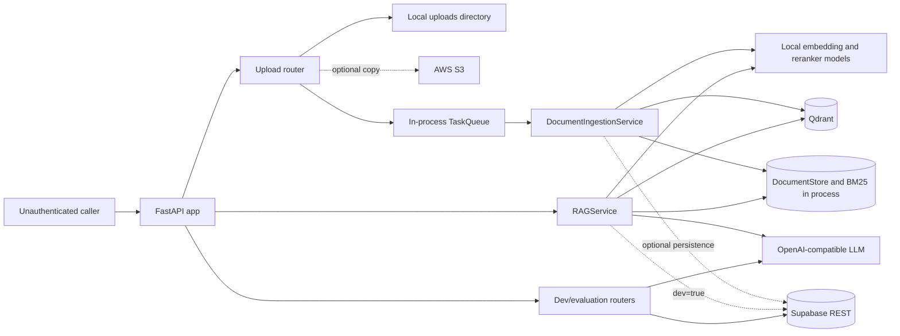
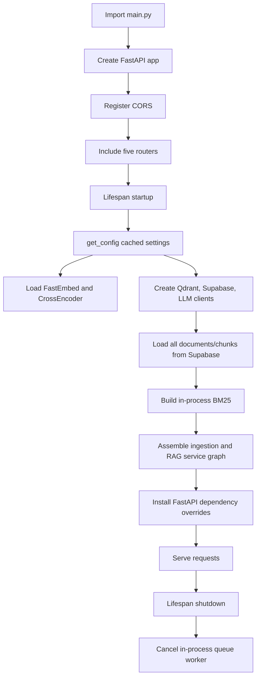
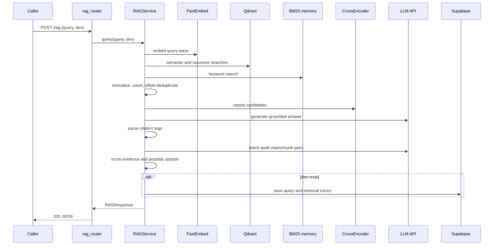
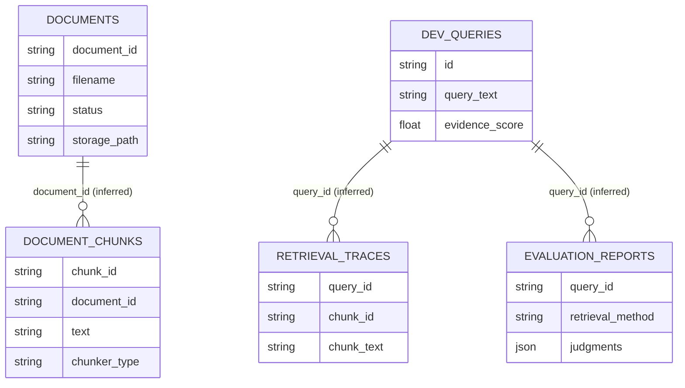
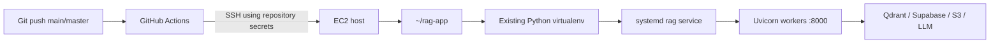

# Backend System Report

> Scope: read-only analysis of the backend repository as inspected on 2026-08-19. The current Python implementation is the source of truth. Secret values are intentionally omitted. Statements labeled **Observed**, **Inference**, **Potential issue**, and **Recommendation** distinguish evidence from interpretation.

# 1. Executive Summary

This repository implements a medical retrieval-augmented generation (RAG) API. It accepts medical reference documents, extracts and cleans their text, creates semantic and recursive chunks, embeds both chunk sets, stores dense vectors in Qdrant, keeps document/chunk metadata in memory and optionally Supabase, builds an in-process BM25 index, and answers questions with hybrid retrieval, cross-encoder reranking, an OpenAI-compatible LLM, citation parsing, and a second LLM-based citation audit.

The web layer is FastAPI with Pydantic v2-style models. The main entry point is `main.py`, exporting `app` for ASGI servers and `handler = Mangum(app)` for a possible AWS Lambda adapter. Runtime services include local FastEmbed and Sentence Transformers models, Qdrant, an OpenAI-compatible generation endpoint, optional Supabase REST persistence, optional AWS S3 object storage, local temporary uploads, and an in-process asyncio ingestion queue.

**Observed:** There is no caller authentication, user model, session, JWT, OAuth/OIDC flow, login endpoint, or security dependency. There is also no authorization, role/permission model, resource ownership check, tenant filter, rate limiter, or admin boundary. Every application endpoint is callable by any network client that can reach it. Provider credentials authenticate the backend to Qdrant, Supabase, S3, and the LLM; they do not authenticate API callers.

**Current trust boundaries:**

- The public/network caller is trusted to submit queries, uploads, evaluation workloads, document identifiers, and developer-trace identifiers.
- The backend trusts its environment configuration and uses privileged service credentials for external systems.
- All documents, chunks, BM25 state, and developer traces are global to the running application/environment rather than scoped to a caller.
- Qdrant and Supabase are trusted persistence services; the LLM provider receives user questions and retrieved medical text; S3 may receive original uploaded file bytes.
- Process memory is a material boundary: `DocumentStore`, BM25, and `TaskQueue` are in-process. Multiple server workers do not share live memory.



# 2. Repository Structure

```text
hackathon-rag/
├── main.py                         # FastAPI app, lifespan wiring, CORS, routers, Mangum handler
├── requirements.txt                # Unpinned Python dependencies
├── .env.example                    # Configuration template; actual .env is ignored
├── README.md                       # Setup, API examples, architecture, deployment notes
├── .github/workflows/deploy.yml    # SSH-based EC2 deployment workflow
├── src/
│   ├── api/                        # Routers and HTTP request/response schemas
│   ├── chunking/                   # Semantic and recursive chunkers
│   ├── cleaning/                   # Text cleaning and PDF OCR fallback
│   ├── db/                         # Direct Supabase REST data-access service
│   ├── deduplication/              # Character-offset candidate deduplication
│   ├── embedding/                  # FastEmbed model wrapper
│   ├── evaluation/                 # LLM judge and retrieval evaluation
│   ├── llm/                        # OpenAI-compatible LLM abstraction/client
│   ├── models/                     # Pydantic domain and response models
│   ├── parsers/                    # PDF, DOCX, DOC, Markdown, TXT, and table parsing
│   ├── queue/                      # In-process sequential asyncio task queue
│   ├── reranking/                  # Sentence Transformers cross-encoder reranker
│   ├── retrieval/                  # Semantic, recursive, and BM25 retrievers
│   ├── services/                   # RAG, ingestion, and document-store orchestration
│   ├── validation/                 # Citation validation and evidence scoring
│   └── vectorstore/                # Qdrant implementation and abstraction
└── docs/
    └── BACKEND_SYSTEM_REPORT.md    # This report
```

There are no tracked migrations, SQL schema files, ORM models, Dockerfiles, Compose files, reverse-proxy files, package lock files, or tests. `.gitignore` explicitly ignores `tests/`, `uploads/`, `.env`, caches, and several specification/agent directories.

# 3. Technology Stack

| Area | Technology | Purpose |
| --- | --- | --- |
| Language/runtime | Python 3.11+ per README | Application runtime; no version file enforces it |
| Web framework | FastAPI | ASGI API, OpenAPI, routing, dependency injection |
| ASGI server | Uvicorn / FastAPI CLI | Local and EC2 process launch |
| Validation | Pydantic, `pydantic-settings` | HTTP/domain models and environment settings |
| Database | Supabase PostgREST via `httpx` | Optional documents/chunks, dev traces, evaluations |
| Vector database | Qdrant | Dense semantic/recursive vectors and chunk payloads |
| LLM API | OpenAI Python client against an OpenAI-compatible base URL | Answer generation, citation audit, evaluation judge |
| Embeddings | FastEmbed `TextEmbedding` | Local 384-dimensional embeddings |
| Reranking | Sentence Transformers `CrossEncoder` | Local cross-encoder candidate reranking |
| Sparse retrieval | `rank-bm25` `BM25Okapi` | In-process keyword retrieval |
| Parsing | PyMuPDF, python-docx, antiword | PDF, DOCX, legacy DOC extraction |
| OCR | pytesseract plus dynamically imported `pdf2image` | Fallback for low-text PDF pages |
| Chunking | `langchain-text-splitters` plus custom semantic chunker | Recursive character and sentence-similarity chunks |
| Object storage | Local filesystem; optional boto3/S3 | Temporary local ingest copy and optional remote original |
| Background jobs | `asyncio.Queue` in application process | Sequential ingestion jobs |
| Logging/tracing | Python `logging`; optional Supabase trace tables | Logs and RAG dev traces |
| Testing | pytest listed only | No tracked tests or pytest configuration |
| Deployment | GitHub Actions SSH to EC2/systemd; Mangum adapter | Implemented EC2 update workflow; Lambda adapter only |

All dependencies in `requirements.txt` are unpinned, so exact backend library versions cannot be determined reliably from the repository. Pydantic v2 is required by code using `model_validator`, `model_copy`, `model_dump`, and `SettingsConfigDict`.

# 4. Application Startup and Runtime Flow

## Entry points and assembly

**Observed:** `main.py` creates `app = FastAPI(...)`. Supported launch examples are `fastapi dev main.py` or `uvicorn main:app --host 0.0.0.0 --port 8000 --reload`. `handler = Mangum(app)` is also exported.

At module import:

1. Router modules are imported.
2. `src/api/dev_router.py` constructs module-global `SupabaseService()` and `LLMJudge()` objects. `LLMJudge` constructs an `OpenAILikeLLMService`/OpenAI client, but makes no network call yet.
3. FastAPI is constructed with the `lifespan` context manager.
4. `CORSMiddleware` is registered.
5. RAG, upload, health, evaluation, and developer routers are included without a common URL prefix.
6. `/static` is mounted only if a repository-root `frontend/` directory exists. No such tracked directory exists, so this mount is absent in the inspected checkout.

At lifespan startup:

1. `get_config()` loads and caches `AppConfig` from process environment and `.env` (`src/config.py`).
2. `EmbeddingService` loads a local FastEmbed model.
3. `QdrantVectorStore` constructs a Qdrant client.
4. singleton `DocumentStore` is constructed and `load_from_supabase()` fetches all documents and chunks if Supabase is configured.
5. parser, cleaner, OCR, semantic chunker, recursive chunker, dense retrievers, deduplicator, reranker, LLM service, and citation validator are created.
6. `BM25Retriever` builds an index from all chunks loaded into the singleton store.
7. `DocumentIngestionService` receives these shared instances.
8. an in-process `TaskQueue` worker is started.
9. `RAGService` receives the shared retrievers/BM25/models.
10. FastAPI dependency overrides replace the default RAG/upload providers with the assembled singleton services.

At shutdown, only `await task_queue.stop()` is called. There are no explicit client close calls, model unloads, job draining, or persistence flushes.



**Potential issue:** The fallback providers `get_rag_service()`, `get_ingestion_service()`, and `get_rag_evaluator()` construct heavy default graphs. Normal application lifespan overrides the first two, but `/evaluate` is not overridden and creates fresh embedding/reranker instances for each request. Direct router tests that do not run lifespan can also construct incomplete/expensive defaults.

# 5. Complete API Endpoint Inventory

## Application endpoints

| Method | Route | Handler | Purpose | Auth Required? | Main service/logic |
| --- | --- | --- | --- | --- | --- |
| POST | `/rag` | `query_rag` | Non-streaming grounded RAG answer | None implemented | shared `RAGService.query` |
| POST | `/rag/stream` | `query_rag_stream` | SSE RAG answer stream | None implemented | shared `RAGService.query_stream` |
| POST | `/upload` | `upload_document` | Store and enqueue document ingestion | None implemented | `save_uploaded_file`, `DocumentStore`, `TaskQueue`, ingestion service |
| GET | `/documents` | `list_documents` | List all global documents | None implemented | singleton `DocumentStore` |
| GET | `/documents/{document_id}/status` | `get_document_status` | Read one global document's status | None implemented | singleton `DocumentStore` |
| GET | `/health` | `get_health_status` | Test Qdrant reachability | None implemented | new `QdrantVectorStore` |
| POST | `/evaluate` | `evaluate_rag` | Evaluate retrieval with LLM-as-judge | None implemented | new `RAGEvaluator` per request |
| GET | `/dev/queries` | `list_logged_queries` | List persisted dev queries | None implemented | module-global `SupabaseService` |
| GET | `/dev/queries/{query_id}/trace` | `get_query_trace` | Return stored retrieval trace text | None implemented | module-global `SupabaseService` |
| POST | `/dev/queries/{query_id}/evaluate` | `evaluate_query_retrieval` | Evaluate/cached-score one trace | None implemented | Supabase plus module-global `LLMJudge` |

## Framework-generated endpoints

FastAPI defaults are not disabled, so the app also exposes `GET /openapi.json`, `GET /docs`, `GET /docs/oauth2-redirect`, and `GET /redoc`. These are public and disclose the API contract. The attempted local route introspection could not import FastAPI because dependencies are not installed in the current environment, but these routes follow directly from the unmodified `FastAPI(...)` constructor defaults.

# 6. Detailed Endpoint Documentation

## `POST /rag`

### Purpose and definition

- File/router/function: `src/api/rag_router.py`, `router`, `query_rag`.
- Request model: `src/api/schemas.py::RAGRequest`.
- Response model: `src/models/response.py::RAGResponse`.

### Request

JSON body: `query` is required, string, Pydantic minimum length 1; `dev` is optional and defaults to `false`. No application header is explicitly consumed beyond normal JSON handling. Empty `""` generally yields FastAPI `422`; whitespace passes model validation but is rejected manually with `400`.

### Response

`RAGResponse` contains `answer`, `citations[]`, optional `citation_validations[]`, `evidence_score` in 0..1, `confidence_label`, `abstained`, and the medical `disclaimer`. `dev_trace` exists on the model but has `exclude=True`, so it is not serialized in the HTTP response even when `dev=true`.

### Status codes and flow

- `200`: generated answer or a deliberate abstention.
- `400`: whitespace-only query.
- `422`: invalid/missing body or field types.
- `503`: router classifies a propagated `RuntimeError` containing vector/Qdrant or LLM/rate-limit/connection text.
- `500`: other runtime or unexpected errors.

```text
HTTP JSON → RAGRequest → query_rag → shared RAGService.query
→ semantic + recursive Qdrant retrieval + in-memory BM25
→ normalize → deduplicate → local CrossEncoder rerank
→ OpenAI-compatible generation → citation parse
→ second LLM citation audit → evidence threshold
→ RAGResponse (and optional Supabase dev trace)
```

### Data and effects

Reads Qdrant and in-memory BM25; sends query plus selected chunk text to the LLM provider. With `dev=true`, writes the full query and retrieval chunk text/scores to Supabase. It does not write conversation history. Qdrant search can attempt to create the configured collection if absent.

### Current security behavior

No authentication, authorization, ownership filtering, quota, or rate limit. Any reachable caller can consume embedding/reranker/LLM resources and query the complete global corpus. The `dev` flag is caller-controlled.

## `POST /rag/stream`

### Purpose and definition

- File/router/function: `src/api/rag_router.py`, `router`, `query_rag_stream`.
- Request: same `RAGRequest` as `/rag`.
- Response: `text/event-stream`, without a FastAPI response model.

### Events and status codes

The async generator may emit:

- `metadata`: JSON with `selected_chunks_count` and `status=context_retrieved`.
- `token`: JSON `{ "delta": <text> }` for each LLM chunk.
- `final`: serialized `RAGResponse` JSON.

It can return `200`, `400`, `422`, or `500` before streaming begins. Although `503` is documented in the decorator, iteration errors occur after `StreamingResponse` is returned and are not caught by the handler's surrounding `try` block; the connection may terminate instead of receiving a structured error.

### Flow, data, effects, and security

Retrieval and final validation mirror `/rag`. LLM tokens are emitted before citations and evidence are validated. A later `final` event may abstain after the caller has already received unsupported raw answer tokens. With `dev=true`, Supabase trace writes occur after generation. No authentication/authorization applies; each call can hold a streaming connection and consume expensive services.

## `POST /upload`

### Purpose and definition

- File/router/function: `src/api/upload_router.py`, `router`, `upload_document`.
- Upload field: required multipart field named `file` (`UploadFile`).
- Response: `UploadResponse`, status `202`.

### Validation and response

Supported suffixes are `.pdf`, `.docx`, `.doc`, `.md`, and `.txt`, based only on the filename extension. The entire file is read into memory, then checked for nonzero length and `MAX_FILE_SIZE_MB`. The response returns UUID `document_id`, original `filename`, extension `file_type`, `queued` status, and a message.

- `202`: saved and enqueued.
- `400`: missing filename, unsupported suffix, empty/corrupt read.
- `413`: byte length above configured maximum.
- `422`: absent/malformed multipart field.
- `500`: local/S3 storage wrapper failure or an otherwise unhandled enqueue/model error.

### Execution flow

```text
multipart request → suffix/size checks → UUID4 document_id
→ write cwd/uploads/{document_id}_{basename}
→ optional S3 head/create/put; fallback to local on S3 error
→ add global Document(status=queued) to memory and optional Supabase
→ enqueue synchronous ingest callable in in-process asyncio queue
→ return 202 before parsing/indexing completes
```

The background ingest sets `processing`, parses/OCRs/cleans, makes both chunk sets, embeds/upserts them, persists metadata/chunks, rebuilds global BM25, sets `completed`/`failed`, then deletes the local temporary file if it exists.

### Data, external systems, side effects, security

Writes local disk immediately, may create an S3 bucket, uploads bytes to S3, creates/updates Supabase records, changes in-memory state, and later upserts Qdrant vectors. Any caller can add globally searchable content and incur compute/storage costs. There is no MIME/magic-byte validation, duplicate detection, malware scanning, ownership, quota, rate limit, or delete endpoint. `Path(filename).name` prevents directory traversal in the local filename, and a UUID prefix avoids ordinary filename collisions.

## `GET /documents`

Defined in `src/api/upload_router.py::list_documents`; response is `DocumentListResponse`. It has no request parameters and returns every document currently in the process singleton, sorted descending by `upload_timestamp`, with ID, filename, type, status, timestamp, and pages. Status is `200`; unexpected serialization/runtime errors use FastAPI's default `500`. There is no pagination or filter. It reads global in-memory state and has no direct write/external call. Anyone can enumerate global document metadata.

## `GET /documents/{document_id}/status`

Defined in `src/api/upload_router.py::get_document_status`; path parameter is an unconstrained string. It returns `DocumentStatusResponse` with ID, filename, status, pages, and `error_message`. Status is `200`, `404` when the singleton has no matching ID, or a default `500`. It performs only an in-memory lookup; it does not refresh Supabase. No caller identity or ownership is checked, creating a direct-object-reference risk once documents should be private. Raw ingestion failure text is returned through `error_message`.

## `GET /health`

Defined in `src/api/health_router.py::get_health_status`; no request fields. It constructs a new `QdrantVectorStore` and calls `get_collections()`. It always returns HTTP `200` with `status=healthy|degraded`, `qdrant_connected`, and hard-coded `models_loaded=true`. Qdrant errors are logged and converted to degraded status. It does not actually inspect the shared vector client, collection existence, local models, Supabase, LLM, S3, queue, or worker readiness. Public access is reasonable, but future production output should remain minimal.

## `POST /evaluate`

Defined in `src/api/eval_router.py::evaluate_rag`; request model `EvaluateRequest` requires nonempty `queries: list[str]` and optional `top_k >= 1` (default 5). The handler manually rejects blank items. Response `EvaluateResponse` contains per-query `EvaluationReport` objects with `precision_at_3`, `precision_at_5`, and detailed chunk judgments.

Each call constructs a new `RAGEvaluator`, which initializes local embedding and reranker models, Qdrant retrievers, an empty BM25 retriever, deduplication, and an LLM judge. For every query it retrieves, reranks, and makes up to four LLM judge calls; judge failures fall back to a lexical overlap heuristic. Status codes are `200`, `400`, `422`, classified `503`, or `500`. It writes no application persistence. Anyone can trigger an unbounded number of queries in the body and expensive model/LLM work; there is no upper list length, quota, or admin restriction.

## `GET /dev/queries`

Defined in `src/api/dev_router.py::list_logged_queries`. Query parameter `limit` defaults to 50 and is constrained 1..200. It returns a list of `QuerySummaryResponse` (`id`, full `query_text`, timestamps, abstention and evidence fields). It returns `503` only when Supabase configuration is absent; Supabase request failures are swallowed by `SupabaseService.get_queries()` and normally become `200 []`. No authentication exists, so potentially sensitive medical queries are enumerable by any caller.

## `GET /dev/queries/{query_id}/trace`

Defined in `src/api/dev_router.py::get_query_trace`; `query_id` is an unconstrained path string. It reads one `dev_queries` row and matching `retrieval_traces`, groups results by semantic/recursive/BM25/reranker, and returns query text plus chunk text, score, filename, and page. It returns `200`, `404` if no query text is recovered, `503` if unconfigured, or validation/default errors. It performs no write. This is a high-value diagnostic disclosure endpoint with no auth, role, or ownership check.

## `POST /dev/queries/{query_id}/evaluate`

Defined in `src/api/dev_router.py::evaluate_query_retrieval`. It takes only a path ID. It loads the trace and existing evaluation reports. Cached per-method reports are returned; otherwise up to five trace items per method are reconstructed as `Chunk` objects, judged in one LLM call per method, scored as percentages, and written to `evaluation_reports`. Status codes are `200`, `404`, `503`, `422` where applicable, and unhandled `500` for errors escaping service fallbacks. Anyone can read trace content, cause LLM spend, and write evaluation records.

**Potential issue:** `get_query_traces()` does not return `document_id` or full chunk metadata, so reconstruction uses `doc_unknown` and synthetic defaults. Reranker items are treated as recursive for `chunker_type` unless the method is exactly semantic.

## FastAPI documentation endpoints

`/openapi.json`, `/docs`, `/docs/oauth2-redirect`, and `/redoc` are generated by FastAPI, read only application metadata, and are public. They return normal framework responses (`200`, or framework `404` only if disabled in a future config). No OAuth scheme is configured despite the docs redirect route existing by default.

# 7. Request-to-Response Call Graph

## RAG question flow



## Document upload/ingestion flow

```mermaid
sequenceDiagram
    participant C as Caller
    participant U as upload_router
    participant F as Local filesystem
    participant S3 as S3 optional
    participant D as DocumentStore/Supabase
    participant Q as TaskQueue
    participant I as IngestionService
    participant M as Parsers/OCR/chunkers/models
    participant V as Qdrant
    C->>U: multipart POST /upload
    U->>U: extension and in-memory size validation
    U->>F: write UUID-prefixed file
    opt AWS credentials configured
        U->>S3: head/create bucket and put object
    end
    U->>D: add queued global document
    U->>Q: enqueue ingest callable
    U-->>C: 202 queued
    Q->>I: ingest(document_id, local path)
    I->>D: status=processing
    I->>M: parse → OCR fallback → clean
    I->>M: semantic + recursive chunks → embeddings
    I->>V: upsert both vector sets
    I->>D: persist chunks; rebuild BM25; completed/failed
    I->>F: delete temporary local file
```

# 8. RAG Architecture

## Ingestion/indexing time

1. `upload_document` assigns a UUID4 document ID and creates a `Document`.
2. `DocumentIngestionService.ingest` selects a parser by the stored `FileType`.
3. PDF parsing is page-level with PyMuPDF and table extraction. DOCX/DOC/MD/TXT are modeled as one page.
4. PDF pages with fewer than 30 stripped characters are eligible for OCR. `OCRProcessor` dynamically imports `pdf2image` and pytesseract.
5. `DocumentCleaner` strips control characters, normalizes newlines, removes trailing whitespace, and appends normalized Markdown tables not already present.
6. `SemanticChunker` splits sentences, embeds each sentence, and starts a new chunk when adjacent cosine similarity is below `SEMANTIC_CHUNK_THRESHOLD` or accumulated text would exceed its hard-coded/default 1500 characters. Its `min_chars` default is zero.
7. `RecursiveChunker` uses `RecursiveCharacterTextSplitter` with configured character size/overlap (defaults 1500/300) and multilingual separators.
8. Both strategies produce `Chunk` metadata: deterministic `{document_id}_{strategy}_{index}`, parent document ID, original filename, 1-based page range, strategy, extraction method, and full-document character offsets.
9. FastEmbed produces vectors. `QdrantVectorStore` assumes vector size 384, cosine distance, and a configured collection. Point IDs are UUID5(DNS namespace, `chunk_id`); payload is the full `Chunk` model. Payload indexes are attempted on `document_id` and `chunker_type`.
10. All chunks are stored in the singleton and optionally Supabase; BM25 is rebuilt over the full in-process corpus.

## Query time

1. Semantic and recursive retrievers each embed the query separately and query Qdrant with a `chunker_type` filter, using `RETRIEVAL_TOP_K` each.
2. BM25 retrieves up to the same K from the in-process corpus and requires at least one overlapping token.
3. Scores are min-max normalized within each retriever. If all scores in one result set are identical, all become 1.0.
4. The union is sorted and deduplicated by overlapping character ranges within the same document at `DEDUP_OVERLAP_THRESHOLD`.
5. `BGEReranker` scores query/chunk pairs and returns `RERANKER_TOP_K`.
6. The system prompt instructs the LLM to use only selected chunks and cite `[Doc: ..., Page: ..., ChunkID: ...]`.
7. `RAGService._parse_citations` parses those tags. Unknown chunk IDs are retained with `document_id=unknown`.
8. `CitationValidator` rejects missing/empty chunks deterministically, classifies medical-risk patterns, and sends remaining claim/chunk pairs to the LLM in one batch. Validation failure conservatively marks claims unsupported.
9. Evidence is risk-weighted, penalizes contradictions, and caps scores with fewer than three citations. If no context, the LLM emits the exact abstention, or score is below `EVIDENCE_THRESHOLD`, the service returns the fixed abstention response.
10. `dev=true` writes full trace data to Supabase, but `DevTrace` is excluded from HTTP serialization.

**Potential issues:** Dense retrieval errors are caught in `QdrantVectorStore.search()` and returned as empty results, so an outage can look like insufficient evidence rather than the router's intended `503`. The generation prompt says WHO chunks even though upload accepts arbitrary content. Streaming exposes tokens before validation. No query-time ownership/tenant filter exists in Qdrant or BM25.

# 9. Data Architecture

| Store | Contents | Readers | Writers | Durability/scope |
| --- | --- | --- | --- | --- |
| `DocumentStore` memory | `Document` objects and all `Chunk` objects | document endpoints, ingestion, BM25 startup/rebuild | upload and ingestion | Process-local singleton; lost on restart unless Supabase rehydrates |
| BM25 memory | tokenized text and chunk references | `RAGService`, `RAGEvaluator` if injected | startup and ingestion rebuild | Process-local; no locking in BM25 itself |
| Supabase REST | documents, document chunks, dev queries, retrieval traces, evaluations | startup, document store, dev endpoints | document store, RAG dev mode, dev evaluation | Optional persistent global store |
| Qdrant | 384-d vectors and complete chunk payload | dense retrievers, health | ingestion; collection/index auto-creation | Persistent or local depending `QDRANT_URL` |
| Local `uploads/` | temporary original upload | parsers/OCR | upload router | Deleted after background ingestion; ignored by Git |
| AWS S3 | optional original upload under `documents/` | No read path found | upload router | Persistent external object copy |
| LLM provider | Prompts include user questions/chunks | N/A | outbound API requests | Provider-controlled processing/retention unknown |

The common join key is `document_id`. `chunk_id` embeds `document_id` plus strategy/index. Qdrant uses a derived UUID5 point ID but retains the original IDs in payload. Dev data uses `query_id` returned by Supabase.

# 10. Database Schema and Models

No migrations or authoritative Supabase DDL are present. The following schema is **inferred** from REST payloads and Pydantic models; primary keys, foreign keys, RLS, defaults, indexes, and constraints are unknown unless noted.

| Entity/table | Known/inferred fields | Relationships and ownership |
| --- | --- | --- |
| `documents` | `document_id`, filename, file_type, file_size_bytes, storage_path, status, total_pages, error_message, upload_timestamp | `document_id` behaves as unique upsert key; no user/owner field |
| `document_chunks` | `chunk_id`, document_id, text, filename, page_start/end, chunk_index, chunker_type, method, start/end char | many chunks to document inferred; no owner field |
| `dev_queries` | `id`, query_text, abstained, evidence_score, created_at | `id` returned by insert; no caller field |
| `retrieval_traces` | query_id, retrieval_method, rank, chunk_id, chunk_text, score, filename, page_start | many traces to dev query inferred; no caller field |
| `evaluation_reports` | query_id, retrieval_method, precision_at_3/5, judgments JSON | many reports to query inferred; no caller field |



Pydantic domain entities are `Document`, `DocumentPage`, `TableData`, `Chunk`, `Citation`, `CitationValidationResult`, `RetrievalResult`, `RerankResult`, `EvaluationResult`, `EvaluationReport`, `DevTrace`, and `RAGResponse`. None includes a user, tenant, role, owner, created-by, visibility, or access-control field.

# 11. External Services and Integrations

## Qdrant

`QdrantVectorStore` initializes `QdrantClient` from `QDRANT_URL`, optional `QDRANT_API_KEY`, timeout, batch size, and collection. It creates a 384-dimensional cosine collection and indexes `document_id`/`chunker_type` when missing, batch-upserts full chunk payloads, filters dense searches by strategy, supports an unused delete-by-document method, and exposes a health helper. Search errors are logged and converted to empty results; upsert errors propagate; collection creation errors return `False`. No retry/backoff is implemented.

## Supabase

`SupabaseService` uses synchronous module-level `httpx` calls to PostgREST endpoints. Credential precedence is `SUPABASE_SECRET_KEY`, then `SUPABASE_KEY`, then `SUPABASE_PUBLISHABLE_KEY`. It sends both `apikey` and Bearer headers. Calls have 10-15 second timeouts, no retries, and generally catch/log failures and return empty/false values. It reads/writes all rows without caller identity or tenant predicates. Actual RLS policy and table schema are unknown.

## AWS S3

`save_uploaded_file` initializes boto3 per upload when both bucket and access key are nonempty. It calls `head_bucket`; any exception causes an attempted bucket creation; then it uploads the original bytes. Errors are logged and silently fall back to local storage. No retry, encryption option, content type, lifecycle rule, presigned URL, download, or deletion is implemented.

## OpenAI-compatible LLM

`OpenAILikeLLMService` builds `OpenAI(base_url, api_key)` and supports normal and streamed chat completions with the configured model. Calls send system/user messages at temperature 0. It translates rate-limit, connection, OpenAI, and generic errors to `RuntimeError`; there is no explicit retry, timeout, circuit breaker, or token limit unless a caller passes one (current core calls do not). User questions and retrieved chunk text leave the backend for generation, citation audit, and evaluation.

## Local model registries/runtime

FastEmbed and Sentence Transformers load configured model identifiers, potentially downloading model artifacts from their upstream registry/cache. Failure can prevent lifespan startup. Model version/revision pinning is absent.

## OCR/system tools

PDF OCR uses `pdf2image.convert_from_path` plus pytesseract, which also requires system Poppler/Tesseract. Legacy DOC uses `subprocess.run(["antiword", path])`. OCR failures generally leave pages unchanged; antiword failures fail ingestion.

# 12. Configuration and Environment Variables

`AppConfig` in `src/config.py` is cached with `lru_cache` and reads process environment plus repository-root `.env`, ignoring extra keys. There is no explicit development/production settings class or environment selector.

| Variable / setting | Required? | Used by | Purpose | Sensitive? |
| --- | --- | --- | --- | --- |
| `LLM_API_KEY` | Required for LLM calls | `OpenAILikeLLMService` | Provider credential | Yes |
| `LLM_BASE_URL` | Has Groq-compatible default | LLM service | OpenAI-compatible endpoint | Possibly |
| `LLM_MODEL` | Has default | LLM service | Generation/judge model ID | No |
| `QDRANT_URL` | Effectively required; localhost default | Qdrant store | Vector DB endpoint | Possibly |
| `QDRANT_API_KEY` | Optional for unsecured/local Qdrant | Qdrant store | Vector DB credential | Yes |
| `QDRANT_TIMEOUT` | Optional, default 60 | Qdrant store | Client timeout | No |
| `QDRANT_BATCH_SIZE` | Optional, default 100 | Qdrant store | Upsert batch size | No |
| `COLLECTION_NAME` | Optional, default `medical_documents` | Qdrant store | Vector collection | No |
| `S3_BUCKET` | Optional in code; nonempty default | upload router | Original-file bucket | No |
| `AWS_REGION` | Optional/default | upload router | S3 region | No |
| `AWS_ACCESS_KEY_ID` | Enables S3 path | upload router | AWS credential | Yes |
| `AWS_SECRET_ACCESS_KEY` | Needed with AWS access key | upload router | AWS credential | Yes |
| `SUPABASE_URL` | Optional in code | Supabase service | PostgREST base URL | Possibly |
| `SUPABASE_KEY` | One credential option | Supabase service | Supabase API credential | Yes |
| `SUPABASE_SECRET_KEY` | One credential option | Supabase service | Preferred privileged credential | Yes |
| `SUPABASE_PUBLISHABLE_KEY` | One credential option | Supabase service | Fallback credential | Yes |
| `EMBEDDING_MODEL` | Optional/default | embedding service | FastEmbed model ID | No |
| `RERANKER_MODEL` | Optional/default | reranker | CrossEncoder model ID | No |
| `MAX_FILE_SIZE_MB` | Optional/default 50 | upload router | Post-read upload limit | No |
| `SEMANTIC_CHUNK_THRESHOLD` | Optional/default 0.50 | semantic chunker | Adjacent sentence break threshold | No |
| `RECURSIVE_CHUNK_SIZE` | Optional/default 1500 | recursive chunker | Character chunk size | No |
| `RECURSIVE_CHUNK_OVERLAP` | Optional/default 300 | recursive chunker | Character overlap | No |
| `RETRIEVAL_TOP_K` | Optional/default 10 | RAG service | Per-strategy candidate K | No |
| `RERANKER_TOP_K` | Optional/default 5 | RAG/reranker | Final context K | No |
| `DEDUP_OVERLAP_THRESHOLD` | Optional/default 0.8 | deduplicator | Overlap duplicate threshold | No |
| `EVIDENCE_THRESHOLD` | Optional/default 0.4 | RAG service | Answer/abstention cutoff | No |

`QDRANT_TIMEOUT`, `QDRANT_BATCH_SIZE`, `SUPABASE_SECRET_KEY`, and `SUPABASE_PUBLISHABLE_KEY` exist in code but are absent from `.env.example`. Conversely, all real `.env` values were treated as secret and were not copied into this report.

# 13. Middleware and Cross-Cutting Behavior

- CORS: `allow_origins=["*"]`, credentials enabled, all methods and headers allowed. This is unsuitable for future cookie authentication and gives no origin-level boundary today.
- Lifecycle: one FastAPI lifespan hook assembles services and cancels the queue at shutdown.
- Dependency injection: route-level `Depends` plus `app.dependency_overrides` for RAG/upload services. No router-global dependencies.
- Validation: FastAPI/Pydantic generate `422` responses; some handlers add manual blank checks.
- Logging: process-wide `logging.basicConfig(INFO, timestamp/name/level/message)`.
- Error handling: no custom middleware or global exception handlers.
- Missing cross-cutting controls: no request logging middleware, request/correlation ID, authentication middleware/dependency, rate limiting, security headers, CSRF defense, body-size middleware, metrics, tracing SDK, or audit actor identity.

# 14. Error Handling

Routers mainly raise `HTTPException(detail=...)`. FastAPI validation uses its standard structured `422` body, which differs from the declared one-field `ErrorResponse`. There are no custom exception classes or global translators.

- `/rag` and `/evaluate` translate `RuntimeError` by substring inspection, a brittle classification mechanism.
- Qdrant search catches all exceptions and returns empty results, potentially hiding outages as RAG abstentions.
- Supabase methods catch errors and return empty/false results, causing several endpoints to report empty/not-found rather than upstream failure.
- citation audit errors fail closed as unsupported; evaluation-judge errors fall back to lexical scoring.
- upload storage catches S3 failures and falls back locally; ingestion catches errors, stores raw `str(err)` as document failure, and returns `False` in the background.
- `/rag/stream` cannot reliably translate errors raised while its async generator is iterated.

Most client-facing unexpected errors are sanitized. Exceptions are logged with details and sometimes stack traces. `DocumentStatusResponse.error_message` can expose raw parser/system/external exception text to any caller. The LLM service includes raw provider error strings inside raised runtime errors, but the RAG router usually replaces them before sending a response.

# 15. Logging, Tracing, and Observability

Python loggers are named by module. Logs include truncated user queries, filenames, document IDs, local/S3 paths, model/base URL identifiers, ingestion errors, and sometimes full exception traces. They do not intentionally log configured API keys.

With `dev=true`, `RAGService` persists the full query, abstention/evidence fields, and up to ten chunk texts per method to Supabase. Developer endpoints expose these traces. There is no caller identity, retention policy, redaction, or audit access log.

**Potential issue:** `SupabaseService.save_dev_trace` reads `item.score`; `RerankResult` uses `rerank_score`, so stored reranker scores are likely `0.0`. Also `DevTrace` is excluded from response serialization despite README claims that `dev=true` returns step-by-step state.

The health endpoint checks only Qdrant collection listing and hard-codes model readiness. There are no metrics, distributed traces, alert hooks, queue-depth endpoint, structured JSON logs, or readiness/liveness separation.

# 16. File Upload and Document Lifecycle

```text
accepted multipart file
→ extension allow-list
→ entire payload buffered and size-checked
→ UUID4 document + UUID-prefixed basename
→ local temporary write
→ optional S3 copy
→ global queued metadata in memory/Supabase
→ sequential process-local ingestion
→ processing
→ parse / OCR / clean / dual chunk / embed
→ Qdrant upsert + Supabase chunk write + BM25 rebuild
→ completed or failed
→ local temporary deletion
```

Formats: PDF, DOCX, DOC, Markdown, text. Default maximum: 50 MiB, checked after reading all bytes. No content signature validation or duplicate hash. Document status values are uploaded, queued, processing, completed, and failed; normal upload begins at queued. Document IDs are random UUID4. Chunk IDs are deterministic within a document/strategy. There is no update, replace, reingest, cancel, delete, or cleanup of S3/Qdrant/Supabase records. There is no ownership: documents are global.

S3 is write-only from this application's perspective. The local copy is always the actual ingestion source and is deleted. If S3 succeeds, `Document.storage_path` records the S3 URI; if it fails, the stored local path may point to a file that is later deleted.

# 17. Current Authentication and Authorization State

## Authentication

- The backend does not identify API users.
- No identity is validated or persisted.
- No `User`/account model or users table appears in code.
- No login, signup, password hashing, API-client key, OAuth2/OIDC, JWT, or external identity provider integration exists.
- Supabase Bearer headers and other API keys are backend-to-provider credentials only.

## Authorization

- No endpoint is protected.
- No roles, permissions, scopes, admin concept, tenant, resource visibility, or ownership check exists.
- All documents, chunks, queries, traces, and evaluations are globally addressable/readable within the environment.
- `Depends(...)` is used only for service injection, never security.

## Sessions/tokens

No application token is issued or validated; there is no expiration, refresh, revocation, session store, cookie, CSRF, or authentication header handling.

## Current trust model

The system treats any caller who can reach the API as fully trusted to read global metadata/traces, upload globally searchable medical content, run RAG and evaluation compute, and trigger external-service spending. Network deployment controls not represented in this repository may narrow reachability, but cannot be assumed.

# 18. Authentication Readiness Analysis

The following is a **future architectural recommendation**, not current behavior.

## Integration points

- `main.py`: add auth-related middleware only where cross-cutting behavior is necessary; prefer FastAPI security dependencies for identity/authorization decisions.
- `src/api/*_router.py`: attach current-user dependencies and explicit policies to each route.
- `src/config.py`: add issuer/audience/key/session settings without mixing client-provider secrets.
- `src/models/` and the missing database schema/migrations: define users, roles if required, ownership/visibility, sessions/refresh tokens if chosen.
- `Document`, `Chunk`, Qdrant payloads, Supabase document/chunk rows, and `DocumentStore`: carry owner/tenant IDs consistently.
- `QdrantVectorStore.search`: accept mandatory ownership/visibility filters; dense filtering alone is insufficient unless BM25 and Supabase use the same scope.
- `BM25Retriever`: prevent a global corpus from leaking across users; likely partition/filter indexes or filter candidates before use.
- `DocumentIngestionService`: preserve actor/owner through asynchronous work and all writes.
- `RAGService`: associate queries/traces with identity and apply corpus policy before prompt construction.
- `SupabaseService`: stop unrestricted `select=*` access patterns and add user/tenant predicates; decide whether service credentials or user-scoped Supabase JWT/RLS is authoritative.
- S3 keys: add a stable tenant/user namespace if objects are private; define access/deletion policy.
- `TaskQueue`: jobs need immutable actor/ownership context and a durable strategy if multiple workers/restarts matter.

## Tentative future access classification

| Endpoint | Likely future access |
| --- | --- |
| `GET /health` | Public, minimal output |
| FastAPI docs/OpenAPI | Public only in intended environments, otherwise restricted/admin |
| `POST /rag` | Authenticated; possibly anonymous only by explicit product decision |
| `POST /rag/stream` | Same as `/rag` |
| `POST /upload` | Authenticated; role/quota policy likely required |
| `GET /documents` | Authenticated, owner/tenant filtered |
| `GET /documents/{id}/status` | Authenticated plus resource ownership/visibility |
| `POST /evaluate` | Admin/developer-only candidate |
| all `/dev/*` | Admin/developer-only |

Decisions required before implementation include user types, registration policy, email/password versus IdP, JWT versus server-side sessions, token transport/refresh/revocation, anonymous RAG access, corpus ownership versus shared curated corpus, document sharing, admin role, trace visibility/retention, conversation history, rate limits, service-to-service clients, and migration of existing ownerless data.

# 19. Security-Relevant Findings Before Authentication

| Severity | Finding | Evidence and impact |
| --- | --- | --- |
| High | Unprotected global upload/write endpoint | `/upload` lets any reachable caller persist metadata, optionally store S3 objects, and index globally searchable vectors |
| High | Unprotected dev trace disclosure | `/dev/queries*` exposes full questions and retrieved medical chunk text without identity checks |
| High | No ownership/tenant boundary | models, Supabase calls, Qdrant searches, BM25, and document endpoints are global |
| High | Unrestricted expensive compute | RAG, streaming, evaluation, model loading, and LLM calls have no auth, quotas, rate limits, or evaluation query-count cap |
| Medium | Permissive CORS | all origins/methods/headers with credentials enabled; must be redesigned before browser credential auth |
| Medium | Upload buffered before size enforcement | the whole body is read before checking `MAX_FILE_SIZE_MB`, allowing memory pressure |
| Medium | Upload type based on suffix only | no MIME/signature/malware validation before parsing with complex libraries/system tools |
| Medium | SSE emits before safety validation | unsupported medical text may be delivered as token events before a final abstention |
| Medium | Raw ingestion errors returned | status endpoint can expose internal parser/path/provider information via `error_message` |
| Medium | Privileged Supabase access without caller context | service selects/writes global rows; actual RLS/credential privilege is unknown |
| Medium | Multi-worker process-local state | EC2 example uses two workers, while documents/BM25/queue are process-local; status and retrieval can diverge |
| Low | Health readiness is inaccurate | `models_loaded=true` is hard-coded and HTTP 200 is returned while degraded |
| Low | Sensitive content in logs/traces | queries, filenames, chunk text, and exceptions may contain sensitive medical information; no retention/redaction policy |
| Low | Automatic bucket/collection creation | runtime may mutate infrastructure when a bucket/collection is missing or inaccessible |
| Informational | Filename traversal mitigation exists | `Path(filename).name` plus UUID prefix limits local path traversal/collisions |
| Informational | Secrets are environment-based | `.env` is ignored; no literal real secret was found in tracked source, but runtime handling/rotation is outside the repo |

# 20. Tests

`pytest` is listed in `requirements.txt`, but there is no tracked test directory, test module, fixture, pytest configuration, CI test job, coverage configuration, or documented test command beyond the dependency itself. `.gitignore` ignores `tests`, which could accidentally keep tests out of version control.

The conventional command would be `pytest`, but it is not established by repository configuration. Tests were not run: there are no tracked tests, and importing `main` failed immediately with `ModuleNotFoundError: No module named 'fastapi'` because project dependencies are not installed in the current environment. No packages were installed, consistent with the task constraints.

Future auth work needs endpoint tests for missing/invalid/expired credentials, roles/scopes, cross-user document and trace access, Qdrant/BM25 tenant filtering, async ownership propagation, and CORS/cookie behavior.

# 21. Local Development

The README specifies Python 3.11+, a virtual environment, `pip install -r requirements.txt`, and a populated `.env`. Launch commands are:

```bash
fastapi dev main.py
# or
uvicorn main:app --host 0.0.0.0 --port 8000 --reload
```

Expected local URL is `http://127.0.0.1:8000`; health is `/health`, Swagger `/docs`, ReDoc `/redoc`. Qdrant and an LLM provider are required for useful RAG behavior. Supabase is optional in code but needed for persistence/dev endpoints; S3 is optional in code; local model artifacts are required. Tesseract/Poppler are needed for OCR and antiword for `.doc`. Docker is not required by the repository, though README suggests Docker as one possible local Qdrant method.

# 22. Deployment Architecture

The implemented workflow `.github/workflows/deploy.yml` triggers on pushes to `main`/`master`, SSHes to a secret `EC2_HOST` as `ubuntu`, hard-resets `~/rag-app` to `origin/main`, activates an existing virtualenv, installs unpinned requirements, restarts systemd unit `rag`, and checks it is active. The README's example unit uses Uvicorn on `0.0.0.0:8000` with two workers.

No reverse proxy, TLS certificate, DNS, firewall/security-group, public URL, secrets provisioning, health-based rollout, rollback, migrations, Docker image, or infrastructure-as-code is present. Mangum exposes a Lambda adapter, but no SAM/Serverless/ECR configuration exists; large local models, local temporary files, and startup behavior make actual Lambda suitability unknown.



# 23. Frontend Contract Relevant to Backend Work

There is no `/api` prefix or version prefix. JSON endpoints use standard FastAPI content types; uploads use `multipart/form-data` field `file`; streaming uses SSE event names `metadata`, `token`, and `final`. The normal response contract is the Pydantic `RAGResponse`, not the inconsistent README sample.

Errors may be `{ "detail": "..." }`, FastAPI validation arrays under `detail`, empty lists after swallowed provider errors, or abrupt SSE termination. CORS currently permits all origins. No auth header/cookie is used. Future frontend work will need an explicit decision on `Authorization: Bearer` versus secure cookies, token refresh/session behavior, CSRF if cookies are used, SSE credential/header support, and handling `401` versus `403`.

# 24. Technical Debt and Inconsistencies

1. README says recursive defaults are 512/64 in feature text; code/config use 1500/300 characters.
2. `.env.example` sets `RERANKER_TOP_K=8`; `AppConfig` and README table default to 5.
3. README says `dev=true` exposes `dev_trace`; `RAGResponse.dev_trace` has `exclude=True`, so it is omitted from HTTP serialization.
4. README response examples use citation fields inconsistent with `Citation` (`citation_id/pages/reason` versus `claim/chunk_id/document_id/filename/page_start/page_end`).
5. README calls S3 required in the env template section, but code makes it optional and falls back locally.
6. OCR code imports `pdf2image`, but `requirements.txt` omits it; README does not clearly list Poppler.
7. Requirements are entirely unpinned, preventing reproducible versions/deployments.
8. `/evaluate` builds heavy models per request and uses a fresh empty BM25 index; it is not wired to the shared startup graph.
9. `main.py` imports/constructs some evaluation symbols but does not dependency-override the evaluation route.
10. Synchronous embedding, Qdrant, LLM, Supabase, parsing, and ingestion work executes from async handlers/queue and can block the event loop.
11. Qdrant and Supabase error swallowing obscures dependency outages and makes declared `503` behavior unreliable.
12. Reranker trace scores are likely stored as zero because the service reads `.score` rather than `.rerank_score`.
13. No delete endpoint calls `QdrantVectorStore.delete`; S3/local/Supabase/vector cleanup is incomplete.
14. Multi-worker deployment conflicts with process-local `DocumentStore`, BM25, and queue consistency.
15. The S3 `storage_path` can refer to a deleted local file on fallback or an S3 URI for which no read path exists.
16. `DocumentStore.add_document` comment calls Supabase persistence asynchronous, but it is a synchronous HTTP call.
17. Table data is extracted and appended to text but not persisted as structured tables after ingestion.
18. Health reports models loaded without checking them and returns HTTP 200 for degraded Qdrant.

# 25. High-Risk Areas for Future Changes

- Ownership must be applied consistently across Supabase rows, Qdrant payload filters, BM25 candidates, in-memory maps, S3 keys, status endpoints, and traces. Updating only routers would still leak data during retrieval.
- Existing Qdrant payloads and Supabase rows have no owner. Backfill/migration policy must precede enforcement.
- `document_id` and deterministic `chunk_id` link all stores. Changing formats risks orphaned or duplicate vectors/rows.
- Background ingestion must carry authenticated identity after the HTTP request ends; relying on request-local context is unsafe.
- Multiple workers have separate queues/BM25/singletons. Auth changes may expose already-existing consistency failures.
- RAG safety depends on exact retrieval, citation parsing, and evidence logic. Adding filters can reduce context and change abstention behavior.
- Developer trace/evaluation tables store full content and need stricter access/retention than ordinary metadata.
- SSE authorization and expiration must be decided before streaming starts; errors after headers are sent cannot become normal `401/403` JSON.
- Service credentials must remain server-side and must not be confused with end-user Supabase tokens.
- Upload authorization must cover storage cost, file processing, global/shared corpus publishing, and delete lifecycle—not merely endpoint access.

# 26. Key Files for Future Authentication Work

| File | Why it matters for authentication |
| --- | --- |
| `main.py` | app lifecycle, middleware, router registration, shared dependency graph |
| `src/config.py` | future issuer/session/security settings |
| `src/api/rag_router.py` | RAG and SSE caller policy |
| `src/api/upload_router.py` | upload authorization, ownership creation, status/list access |
| `src/api/dev_router.py` | sensitive trace/admin endpoints |
| `src/api/eval_router.py` | expensive developer/admin operation |
| `src/api/schemas.py` | HTTP contract changes |
| `src/models/document.py` | document ownership/visibility metadata |
| `src/models/chunk.py` | ownership/tenant propagation into vector payloads |
| `src/services/document_store.py` | global in-memory and Supabase access patterns |
| `src/services/ingestion_service.py` | propagate owner into chunks/background writes |
| `src/services/rag_service.py` | user-scoped retrieval and query/trace attribution |
| `src/retrieval/bm25_retriever.py` | prevent cross-user sparse retrieval |
| `src/vectorstore/qdrant_store.py` | mandatory tenant/visibility filters |
| `src/db/supabase_service.py` | schema, predicates, user/tenant access, RLS strategy |
| `src/queue/task_queue.py` | background actor context and durability |

# 27. Recommended Authentication Implementation Order

1. Decide identity provider, user types, shared-versus-owned corpus semantics, anonymous access, and admin/developer policy.
2. Define authoritative database schema/migrations for users/identities, ownership/visibility, roles if needed, and session/token state if applicable.
3. Design migration/default policy for existing ownerless documents, chunks, vectors, traces, and S3 objects.
4. Add security configuration and a single tested FastAPI current-principal dependency; define `401`/`403` contracts.
5. Protect dev/evaluation/write endpoints first, then read/query endpoints according to the chosen public policy.
6. Propagate principal/tenant IDs through upload, queue jobs, `DocumentStore`, ingestion, Supabase records, Qdrant payloads, S3 keys, and dev traces.
7. Enforce identical ownership/visibility filters in document APIs, Supabase reads, Qdrant search, and BM25 retrieval.
8. Add deletion/cleanup semantics and authorization for every persistent store.
9. Replace wildcard CORS with explicit trusted origins; finalize cookie/CSRF or Bearer-token behavior including SSE.
10. Add rate limits, upload/query quotas, audit logging with actor IDs, secret separation, and safe observability.
11. Add unit/integration/security tests, including cross-user isolation and multi-worker/background scenarios.
12. Update frontend contract and deployment configuration, then migrate/backfill and roll out with monitoring.

# 28. Unknowns and Questions for the Developer

1. Who are the intended caller types: clinicians, administrators, developers, service clients, or public users?
2. Is the medical document corpus globally curated, privately user-owned, tenant-owned, or shareable?
3. Should anonymous RAG queries remain possible? If so, against which corpus and limits?
4. Which identity mechanism is desired: Supabase Auth, another OIDC provider, email/password, enterprise SSO, or combinations?
5. Are secure cookie sessions or Bearer access/refresh tokens preferred, and what clients must be supported?
6. What admin/developer roles and permissions are required for upload, evaluation, docs, and trace access?
7. What ownership should be assigned to existing documents/chunks/traces without user fields?
8. What are the actual Supabase DDL, constraints, RLS policies, credential privileges, and backup/retention rules?
9. Is Qdrant shared across environments/tenants, and does the installed version support the planned payload filters/indexes?
10. Are uploaded originals required after ingestion, and what deletion/retention/compliance policy applies to S3?
11. May queries or document text contain protected health information, and what logging/provider/retention rules apply?
12. Is the EC2 two-worker layout current, and is a durable external queue planned?
13. What reverse proxy/API gateway, TLS, firewall, VPN, and public URL exist outside this repository?
14. Are API docs and developer endpoints intended in production?
15. What per-user/tenant rate, storage, upload-size, and LLM-cost limits are required?
16. Is conversation history required, and if so is it private per user/tenant?
17. Is Lambda a real target or only an adapter experiment?

# 29. Backend Mental Model

- `main.py` is the ASGI entry point and the only composition root.
- Lifespan startup eagerly loads local embedding and reranker models.
- Dependency overrides supply shared RAG/upload services during normal app execution.
- Ten application endpoints exist; all are unprotected.
- There is no user, session, token, role, permission, tenant, or ownership concept.
- Uploads are global and become globally searchable.
- Local files are temporary; S3 is optional and write-only in current code.
- Supabase is optional but is the only persistent document metadata/chunk/dev-trace store in code.
- Supabase schema is not tracked; documented tables are inferred from REST calls.
- Qdrant stores both semantic and recursive vectors in one 384-d cosine collection.
- `document_id`/`chunk_id` connect memory, Supabase, Qdrant, traces, and filenames.
- BM25, document state, and task queue are process-local; workers do not share live state.
- RAG uses two dense searches plus BM25, normalization, offset deduplication, cross-encoder reranking, generation, and a second LLM citation audit.
- Streaming sends answer tokens before final evidence validation.
- `dev=true` persists sensitive query/chunk traces, while `dev_trace` is excluded from the HTTP response.
- Developer/evaluation endpoints expose sensitive data and expensive operations without access control.
- Qdrant/Supabase failures are often swallowed, which can mask outages as empty results.
- Requirements are unpinned, OCR dependencies are incomplete, and no tests are tracked.
- Authentication must filter every retrieval/persistence layer, not only FastAPI routes.
- Ownership migration and product policy decisions must come before implementation.

# 30. Source Map

## Application startup

- `main.py`
- `src/config.py`

## API layer

- `src/api/schemas.py`
- `src/api/rag_router.py`
- `src/api/upload_router.py`
- `src/api/health_router.py`
- `src/api/eval_router.py`
- `src/api/dev_router.py`

## RAG and models

- `src/services/rag_service.py`
- `src/models/response.py`
- `src/models/citation.py`
- `src/models/retrieval.py`
- `src/models/chunk.py`
- `src/deduplication/chunk_deduplicator.py`
- `src/validation/citation_validator.py`
- `src/evaluation/llm_judge.py`
- `src/evaluation/rag_evaluator.py`

## Ingestion, parsing, and chunking

- `src/services/ingestion_service.py`
- `src/chunking/base.py`
- `src/chunking/semantic_chunker.py`
- `src/chunking/recursive_chunker.py`
- `src/parsers/base.py`
- `src/parsers/pdf_parser.py`
- `src/parsers/docx_parser.py`
- `src/parsers/doc_parser.py`
- `src/parsers/markdown_parser.py`
- `src/parsers/txt_parser.py`
- `src/parsers/table_extractor.py`
- `src/cleaning/document_cleaner.py`
- `src/cleaning/ocr_processor.py`

## Storage and database

- `src/services/document_store.py`
- `src/db/supabase_service.py`
- `src/vectorstore/base.py`
- `src/vectorstore/qdrant_store.py`
- `src/queue/task_queue.py`

## Integrations and retrieval

- `src/embedding/embedding_service.py`
- `src/reranking/bge_reranker.py`
- `src/retrieval/base.py`
- `src/retrieval/semantic_retriever.py`
- `src/retrieval/recursive_retriever.py`
- `src/retrieval/bm25_retriever.py`
- `src/llm/base.py`
- `src/llm/llm_service.py`

## Tests

- No tracked test files or test configuration exist.

## Documentation, configuration, and deployment

- `README.md`
- `.env.example`
- `.gitignore`
- `requirements.txt`
- `.github/workflows/deploy.yml`

